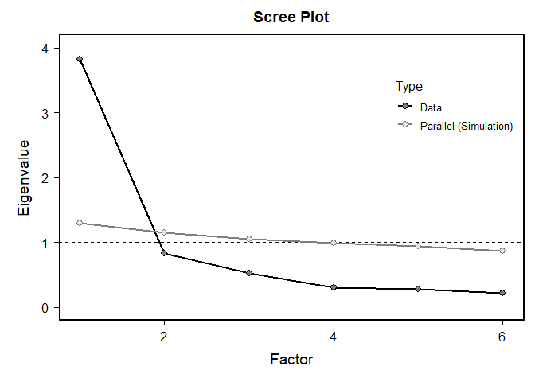
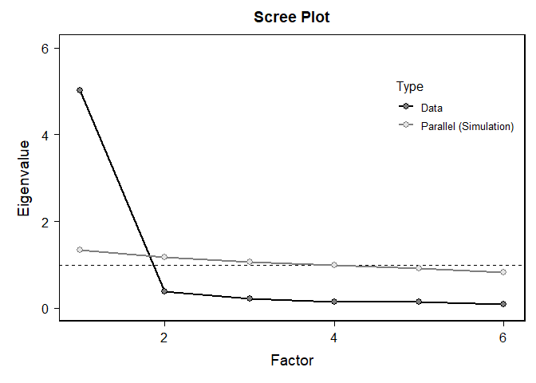
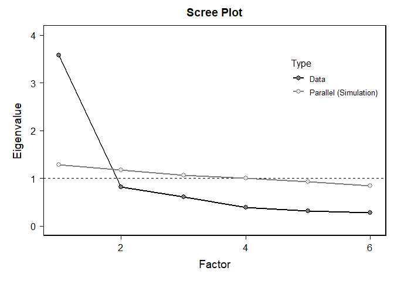

Lab9
================
Jack Sutton
2024-11-07

``` r
library(tidyverse)
```

    ## ── Attaching core tidyverse packages ──────────────────────── tidyverse 2.0.0 ──
    ## ✔ dplyr     1.1.4     ✔ readr     2.1.5
    ## ✔ forcats   1.0.0     ✔ stringr   1.5.1
    ## ✔ ggplot2   3.5.1     ✔ tibble    3.2.1
    ## ✔ lubridate 1.9.3     ✔ tidyr     1.3.1
    ## ✔ purrr     1.0.2     
    ## ── Conflicts ────────────────────────────────────────── tidyverse_conflicts() ──
    ## ✖ dplyr::filter() masks stats::filter()
    ## ✖ dplyr::lag()    masks stats::lag()
    ## ℹ Use the conflicted package (<http://conflicted.r-lib.org/>) to force all conflicts to become errors

``` r
library(bruceR)
```

    ## 
    ## bruceR (v2024.6)
    ## Broadly Useful Convenient and Efficient R functions
    ## 
    ## Packages also loaded:
    ## ✔ data.table ✔ emmeans
    ## ✔ dplyr      ✔ lmerTest
    ## ✔ tidyr      ✔ effectsize
    ## ✔ stringr    ✔ performance
    ## ✔ ggplot2    ✔ interactions
    ## 
    ## Main functions of `bruceR`:
    ## cc()             Describe()  TTEST()
    ## add()            Freq()      MANOVA()
    ## .mean()          Corr()      EMMEANS()
    ## set.wd()         Alpha()     PROCESS()
    ## import()         EFA()       model_summary()
    ## print_table()    CFA()       lavaan_summary()
    ## 
    ## For full functionality, please install all dependencies:
    ## install.packages("bruceR", dep=TRUE)
    ## 
    ## Online documentation:
    ## https://psychbruce.github.io/bruceR
    ## 
    ## To use this package in publications, please cite:
    ## Bao, H.-W.-S. (2024). bruceR: Broadly useful convenient and efficient R functions (Version 2024.6) [Computer software]. https://CRAN.R-project.org/package=bruceR
    ## 
    ## 
    ## These packages are dependencies of `bruceR` but not installed:
    ## - pacman, openxlsx, ggtext, lmtest, vars, phia, MuMIn, GGally
    ## 
    ## ***** Install all dependencies *****
    ## install.packages("bruceR", dep=TRUE)

``` r
library(haven)


lab9data<-read_sav("C:/Users/ajsut/Documents/GitHub/myproject/Lab9/lab9data.sav")
```

<https://www.neellab.ca/uploads/1/2/1/1/121173522/the_fundamental_social_motives_inventory.pdf>

# Reliability

``` r
#Option 1: 
#The traditional way is to recode your items first, then use the recoded items to test reliability

lab9data$FSMI3_R <- 8 - lab9data$FSMI3
lab9data$FSMI57_R <- 8 - lab9data$FSMI57
lab9data$FSMI58_R <- 8 - lab9data$FSMI58

#If you use the unrecoded items, it will mess up the Cronbach's alpha and lead you to draw wrong conclusion

Alpha(lab9data, "FSMI", c("1", "2", "3_R", "4", "5", "6"))
```

    ## 
    ## Reliability Analysis
    ## 
    ## Summary:
    ## Total Items: 6
    ## Scale Range: 1 ~ 7
    ## Total Cases: 300
    ## Valid Cases: 297 (99.0%)
    ## 
    ## Scale Statistics:
    ## Mean = 4.535
    ## S.D. = 1.318
    ## Cronbach’s α = 0.873
    ## McDonald’s ω = 0.887
    ## 
    ## Item Statistics (Cronbach’s α If Item Deleted):
    ## ──────────────────────────────────────────────────
    ##           Mean    S.D. Item-Rest Cor. Cronbach’s α
    ## ──────────────────────────────────────────────────
    ## FSMI1    4.148 (1.722)          0.776        0.833
    ## FSMI2    4.943 (1.468)          0.729        0.845
    ## FSMI3_R  4.512 (1.835)          0.367        0.906
    ## FSMI4    4.185 (1.848)          0.749        0.838
    ## FSMI5    4.458 (1.696)          0.791        0.831
    ## FSMI6    4.966 (1.500)          0.708        0.847
    ## ──────────────────────────────────────────────────
    ## Item-Rest Cor. = Corrected Item-Total Correlation

``` r
#Option 2:
#If you don't want to recode your variable, you can use the shortcut below
Alpha(lab9data, "FSMI", 1:6, rev = 3)
```

    ## 
    ## Reliability Analysis
    ## 
    ## Summary:
    ## Total Items: 6
    ## Scale Range: 1 ~ 7
    ## Total Cases: 300
    ## Valid Cases: 297 (99.0%)
    ## 
    ## Scale Statistics:
    ## Mean = 4.535
    ## S.D. = 1.318
    ## Cronbach’s α = 0.873
    ## McDonald’s ω = 0.887
    ## 
    ## Item Statistics (Cronbach’s α If Item Deleted):
    ## ──────────────────────────────────────────────────────
    ##               Mean    S.D. Item-Rest Cor. Cronbach’s α
    ## ──────────────────────────────────────────────────────
    ## FSMI1        4.148 (1.722)          0.776        0.833
    ## FSMI2        4.943 (1.468)          0.729        0.845
    ## FSMI3 (rev)  4.512 (1.835)          0.367        0.906
    ## FSMI4        4.185 (1.848)          0.749        0.838
    ## FSMI5        4.458 (1.696)          0.791        0.831
    ## FSMI6        4.966 (1.500)          0.708        0.847
    ## ──────────────────────────────────────────────────────
    ## Item-Rest Cor. = Corrected Item-Total Correlation

# Exploratory Factor Analysis

``` r
#In factor analysis, using reverse scored items or not does not make a difference in interpretation. If you use unrecoded items, it will just make the loadings negative

EFA(lab9data, "FSMI", 1:6, rev = 3, method = "pa", plot.scree = TRUE, nfactors = c("parallel"))
```

    ## 
    ## Explanatory Factor Analysis
    ## 
    ## Summary:
    ## Total Items: 6
    ## Scale Range: 1 ~ 7
    ## Total Cases: 300
    ## Valid Cases: 297 (99.0%)
    ## 
    ## Extraction Method:
    ## - Principal Axis Factor Analysis
    ## Rotation Method:
    ## - (Only one component was extracted. The solution was not rotated.)
    ## 
    ## KMO and Bartlett's Test:
    ## - Kaiser-Meyer-Olkin (KMO) Measure of Sampling Adequacy: MSA = 0.875
    ## - Bartlett's Test of Sphericity: Approx. χ²(15) = 1006.50, p < 1e-99 ***
    ## 
    ## Total Variance Explained:
    ## ───────────────────────────────────────────────────────────────────────────────
    ##           Eigenvalue Variance % Cumulative % SS Loading Variance % Cumulative %
    ## ───────────────────────────────────────────────────────────────────────────────
    ## Factor 1       3.827     63.786       63.786      3.470     57.834       57.834
    ## Factor 2       0.833     13.883       77.669                                   
    ## Factor 3       0.532      8.871       86.540                                   
    ## Factor 4       0.306      5.105       91.645                                   
    ## Factor 5       0.277      4.621       96.266                                   
    ## Factor 6       0.224      3.734      100.000                                   
    ## ───────────────────────────────────────────────────────────────────────────────
    ## 
    ## Factor Loadings (Sorted by Size):
    ## ──────────────────────────────
    ##                PA1 Communality
    ## ──────────────────────────────
    ## FSMI5        0.868       0.754
    ## FSMI1        0.844       0.712
    ## FSMI4        0.801       0.641
    ## FSMI2        0.788       0.621
    ## FSMI6        0.771       0.594
    ## FSMI3 (rev)  0.384       0.147
    ## ──────────────────────────────
    ## Communality = Sum of Squared (SS) Factor Loadings
    ## (Uniqueness = 1 - Communality)

<!-- -->

``` r
#There's only one factor here... eigenvalue is above 1,
```

\#this is a pretty good scale but the reverse scored measure does not
have high factor loading… (it is below .4)

# Now test reliability for the status seeking subscale

``` r
#items 31-36 test status seeking (36isR)

Alpha(lab9data, "FSMI", 31:36, rev = 36)
```

    ## 
    ## Reliability Analysis
    ## 
    ## Summary:
    ## Total Items: 6
    ## Scale Range: 1 ~ 7
    ## Total Cases: 300
    ## Valid Cases: 296 (98.7%)
    ## 
    ## Scale Statistics:
    ## Mean = 3.781
    ## S.D. = 1.246
    ## Cronbach’s α = 0.830
    ## McDonald’s ω = 0.840
    ## 
    ## Item Statistics (Cronbach’s α If Item Deleted):
    ## ───────────────────────────────────────────────────────
    ##                Mean    S.D. Item-Rest Cor. Cronbach’s α
    ## ───────────────────────────────────────────────────────
    ## FSMI31        3.473 (1.733)          0.715        0.778
    ## FSMI32        3.686 (1.885)          0.628        0.798
    ## FSMI33        3.878 (1.673)          0.736        0.775
    ## FSMI34        3.713 (1.649)          0.701        0.782
    ## FSMI35        4.807 (1.603)          0.549        0.813
    ## FSMI36 (rev)  3.128 (1.602)          0.302        0.858
    ## ───────────────────────────────────────────────────────
    ## Item-Rest Cor. = Corrected Item-Total Correlation

# Q1: What is the Cronbach’s alpha of this subscale? Is it a reliable measure of status seeking? Why?

Cronbach’s alpha of 0.83 demonstrates good reliability for this scale.
It has more than acceptable internal consistency between items in the
scale.

# Now run a factor analysis on the Mate Retention (Breakup Concern) subscale

``` r
EFA(lab9data, "FSMI", 49:54, method = "pa", plot.scree = TRUE, nfactors = c("parallel"))
```

    ## 
    ## Explanatory Factor Analysis
    ## 
    ## Summary:
    ## Total Items: 6
    ## Scale Range: 1 ~ 7
    ## Total Cases: 300
    ## Valid Cases: 206 (68.7%)
    ## 
    ## Extraction Method:
    ## - Principal Axis Factor Analysis
    ## Rotation Method:
    ## - (Only one component was extracted. The solution was not rotated.)
    ## 
    ## KMO and Bartlett's Test:
    ## - Kaiser-Meyer-Olkin (KMO) Measure of Sampling Adequacy: MSA = 0.905
    ## - Bartlett's Test of Sphericity: Approx. χ²(15) = 1434.86, p < 1e-99 ***
    ## 
    ## Total Variance Explained:
    ## ───────────────────────────────────────────────────────────────────────────────
    ##           Eigenvalue Variance % Cumulative % SS Loading Variance % Cumulative %
    ## ───────────────────────────────────────────────────────────────────────────────
    ## Factor 1       5.015     83.578       83.578      4.823     80.378       80.378
    ## Factor 2       0.386      6.436       90.014                                   
    ## Factor 3       0.213      3.549       93.563                                   
    ## Factor 4       0.153      2.548       96.111                                   
    ## Factor 5       0.139      2.313       98.424                                   
    ## Factor 6       0.095      1.576      100.000                                   
    ## ───────────────────────────────────────────────────────────────────────────────
    ## 
    ## Factor Loadings (Sorted by Size):
    ## ─────────────────────────
    ##           PA1 Communality
    ## ─────────────────────────
    ## FSMI51  0.940       0.883
    ## FSMI52  0.928       0.861
    ## FSMI50  0.899       0.809
    ## FSMI49  0.893       0.797
    ## FSMI54  0.892       0.795
    ## FSMI53  0.823       0.678
    ## ─────────────────────────
    ## Communality = Sum of Squared (SS) Factor Loadings
    ## (Uniqueness = 1 - Communality)

<!-- -->

# Q2: How many factors can you identify from the results? Based on what? What is the range of the factor loadings? What is item that has the highest factor loading? In conclusion, is this a good measure of break up concern and why?

There’s only 1 factor here because the eigenvalue is above 1, its point
is on the slope not the the scree/flat part, and it is above the
parallel. The range of the loadings are 0.940 - 0.823. The item with the
highest loading is item 51 at 0.940. All factors are above .4 and very
close to 1, meaning they all highly influence the dependent variable.

# Q3: Pick another subscale from FSMI. Test reliability and factor analysis. Answer all the questions above.

``` r
#affiliation (independence) (items 25-30)

#reliability

Alpha(lab9data, "FSMI", 25:30)
```

    ## 
    ## Reliability Analysis
    ## 
    ## Summary:
    ## Total Items: 6
    ## Scale Range: 1 ~ 7
    ## Total Cases: 300
    ## Valid Cases: 292 (97.3%)
    ## 
    ## Scale Statistics:
    ## Mean = 5.010
    ## S.D. = 1.264
    ## Cronbach’s α = 0.858
    ## McDonald’s ω = 0.865
    ## 
    ## Item Statistics (Cronbach’s α If Item Deleted):
    ## ─────────────────────────────────────────────────
    ##          Mean    S.D. Item-Rest Cor. Cronbach’s α
    ## ─────────────────────────────────────────────────
    ## FSMI25  4.627 (1.769)          0.734        0.818
    ## FSMI26  4.373 (1.818)          0.699        0.825
    ## FSMI27  4.702 (1.814)          0.503        0.864
    ## FSMI28  5.503 (1.509)          0.633        0.838
    ## FSMI29  5.579 (1.418)          0.597        0.844
    ## FSMI30  5.277 (1.534)          0.759        0.816
    ## ─────────────────────────────────────────────────
    ## Item-Rest Cor. = Corrected Item-Total Correlation

\#For the affiliation (independence) scale, Cronbach’s alpha of .858 is
quite high so we can say the scale is internally consistent and its
items are interrelated.

``` r
#factor analysis and loadings

EFA(lab9data, "FSMI", 25:30, method = "pa", plot.scree = TRUE, nfactors = c("parallel"))
```

    ## 
    ## Explanatory Factor Analysis
    ## 
    ## Summary:
    ## Total Items: 6
    ## Scale Range: 1 ~ 7
    ## Total Cases: 300
    ## Valid Cases: 292 (97.3%)
    ## 
    ## Extraction Method:
    ## - Principal Axis Factor Analysis
    ## Rotation Method:
    ## - (Only one component was extracted. The solution was not rotated.)
    ## 
    ## KMO and Bartlett's Test:
    ## - Kaiser-Meyer-Olkin (KMO) Measure of Sampling Adequacy: MSA = 0.847
    ## - Bartlett's Test of Sphericity: Approx. χ²(15) = 797.97, p < 1e-99 ***
    ## 
    ## Total Variance Explained:
    ## ───────────────────────────────────────────────────────────────────────────────
    ##           Eigenvalue Variance % Cumulative % SS Loading Variance % Cumulative %
    ## ───────────────────────────────────────────────────────────────────────────────
    ## Factor 1       3.577     59.616       59.616      3.131     52.181       52.181
    ## Factor 2       0.819     13.653       73.269                                   
    ## Factor 3       0.618     10.299       83.568                                   
    ## Factor 4       0.386      6.437       90.005                                   
    ## Factor 5       0.315      5.250       95.255                                   
    ## Factor 6       0.285      4.745      100.000                                   
    ## ───────────────────────────────────────────────────────────────────────────────
    ## 
    ## Factor Loadings (Sorted by Size):
    ## ─────────────────────────
    ##           PA1 Communality
    ## ─────────────────────────
    ## FSMI30  0.846       0.716
    ## FSMI25  0.802       0.644
    ## FSMI26  0.750       0.563
    ## FSMI28  0.689       0.475
    ## FSMI29  0.669       0.448
    ## FSMI27  0.534       0.285
    ## ─────────────────────────
    ## Communality = Sum of Squared (SS) Factor Loadings
    ## (Uniqueness = 1 - Communality)

<!-- --> \#There’s only
1 factor here because the eigenvalue is above 1, its point is on the
slope not the the scree/flat part, and it exists above the parallel. The
range of the loadings are between .846 and .534. The item with the
highest loading is item 30 at .846. All factors are above .4. This means
they’re all pretty high predictors of variance in the dependent
variable. I would exercise caution with interpreting item 27 since it is
a bit close to .4. Of all the items, it would be the weakest predictor
on the dependent variable.
